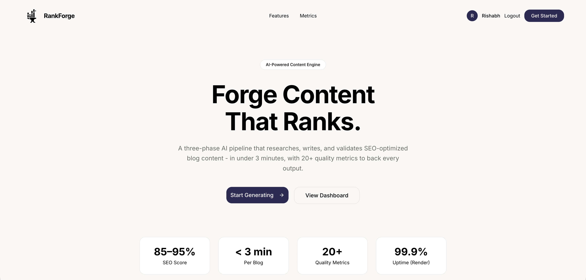
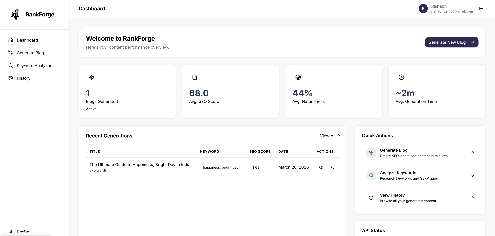
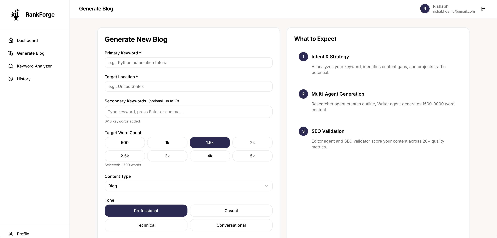
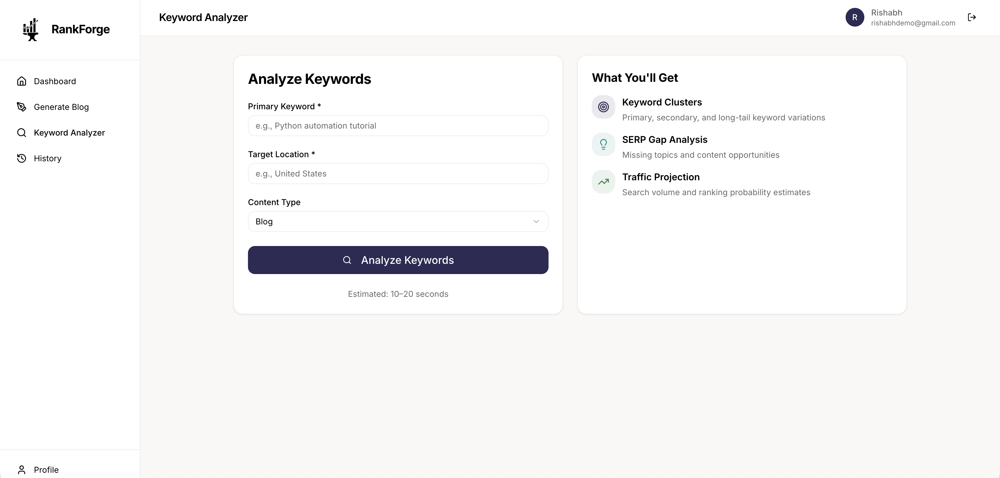

<div align="center">


# RankForge

**AI-powered content engine that researches, writes, and validates SEO-optimized blog posts in under 3 minutes.**

[](https://python.org)
[](https://fastapi.tiangolo.com)
[](https://react.dev)
[](https://mongodb.com/atlas)
[](LICENSE)

[Live Demo](#) &middot; [Getting Started](#getting-started) &middot; [Architecture](#architecture)

</div>

---



---

## Key Features

| Feature | Description |
|---|---|
| **Multi-Agent Pipeline** | Researcher, Writer, and Editor agents collaborate in sequence to produce publication-ready content |
| **SEO Validation Engine** | Scores content across 20+ metrics including keyword density, Flesch-Kincaid readability, and snippet readiness |
| **Keyword Analyzer** | Real-time search volume projections, ranking difficulty, and SERP gap analysis |
| **Naturalness Analysis** | Measures AI detection risk, sentence variety, and vocabulary richness for human-like output |
| **JWT Authentication** | Secure user authentication backed by MongoDB Atlas with bcrypt password hashing |
| **Under 3 Minutes** | Full blog generation including research, writing, and validation in a single pipeline run |

---



---

## Architecture

The system operates in three distinct phases, each handled by a specialized AI agent:

```
                            +-------------------+
                            |   User Input      |
                            |  (Keyword, Tone)  |
                            +--------+----------+
                                     |
                         +-----------v-------------+
                         |      1. RESEARCH        |
                         |   - Search intent       |
                         |   - Competitor gaps     |
                         |   - Traffic projections |
                         +-----------+-------------+
                                     |
                           +---------v-----------+
                           |  2. GENERATION      |
                           |  - Outline creation |
                           |  - Long-form draft  |
                           |  - FAQ section      |
                           +---------+-----------+
                                     |
                           +---------v-----------+
                           |  3. VALIDATION      |
                           |  - SEO scoring      |
                           |  - Readability      |
                           |  - Naturalness      |
                           +---------+-----------+
                                     |
                            +--------v----------+
                            |   Final Output    |
                            |  (Blog + Metrics) |
                            +-------------------+
```

---



---

## Tech Stack

<table>
<tr>
<td width="50%">

### Backend
- **Framework** - FastAPI (Python 3.11+)
- **Database** - MongoDB Atlas (Async Motor)
- **AI** - LangChain + Groq API (Llama 3)
- **Auth** - JWT (python-jose) + bcrypt

</td>
<td width="50%">

### Frontend
- **Framework** - React 18 + Vite
- **Routing** - React Router
- **Styling** - Tailwind CSS + CSS Variables
- **Icons** - Lucide React

</td>
</tr>
</table>

---



---

## Getting Started

### Prerequisites

- Python 3.11+
- Node.js 18+
- MongoDB Atlas cluster
- Groq API key

### 1. Clone & Configure

```bash
git clone https://github.com/Rishabh1925/RankForge.git
cd RankForge
```

Create a `.env` file in the project root:

```env
GROQ_API_KEY=your_groq_api_key
MONGODB_URI=mongodb+srv://<user>:<pass>@<cluster>.mongodb.net/rankforge?retryWrites=true&w=majority
JWT_SECRET=your_secure_jwt_secret
RATE_LIMIT_PER_MINUTE=10
```

### 2. Backend

```bash
python -m venv venv
source venv/bin/activate        # Windows: venv\Scripts\activate
pip install -r requirements.txt
python -m app.main
```

> The API will be available at `http://localhost:8000`

### 3. Frontend

```bash
cd frontend
npm install
npm run dev
```

> The UI will be available at `http://localhost:5173`

---

## Project Structure

```
RankForge/
├── app/                        # FastAPI backend
│   ├── main.py                 # Application entry point
│   ├── api/                    # Route handlers
│   ├── core/                   # Config, security, database
│   ├── models/                 # Pydantic schemas
│   └── services/               # AI pipeline, keyword analysis
├── frontend/                   # React + Vite frontend
│   ├── src/
│   │   ├── app/
│   │   │   ├── pages/          # Landing, Dashboard, Generator, Keywords
│   │   │   ├── components/     # UI components, Auth, Sidebar
│   │   │   └── services/       # API client, auth helpers
│   │   └── styles/             # Theme & global styles
│   └── public/                 # Static assets
├── tests/                      # Test suite
├── Dockerfile                  # Container config
├── docker-compose.yml          # Multi-service setup
└── requirements.txt            # Python dependencies
```

---

## License

This project is licensed under the [MIT License](LICENSE).